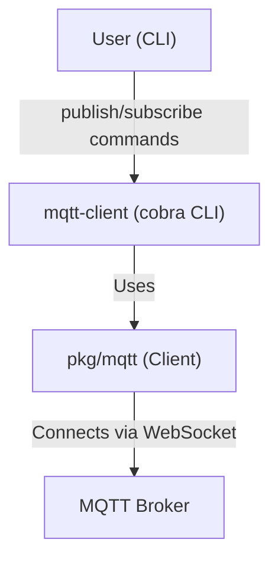

# mqtt-client

A simple command-line MQTT WebSocket client written in Go. This tool allows you to publish messages (including periodic timestamps) and subscribe to topics on an MQTT broker over WebSockets.

---

## Features
- Connect to any MQTT broker supporting WebSockets
- Publish custom messages or periodic timestamps
- Subscribe to topics and print received messages
- Configurable broker address, port, and topic

---

## Download & Installation

1. **Download the latest release:**
   - Go to the [Releases page](https://github.com/atakanaydinbas/mqtt-client/releases) of this repository.
   - Download the appropriate binary for your operating system (e.g., `mqtt-client-darwin-amd64`, `mqtt-client-linux-amd64`, etc.).
2. **(Optional) Rename and move the binary:**
   ```sh
   mv mqtt-client-* mqtt-client
   chmod +x mqtt-client
   sudo mv mqtt-client /usr/local/bin/
   ```
3. **Verify installation:**
   ```sh
   mqtt-client --help
   ```

---

## 📥 Quick Download by Operating System

Download the appropriate binary for your operating system and architecture using `wget`:

```sh
# For Linux
wget https://github.com/atakanaydinbas/mqtt-client/releases/download/v1.0.0/mqtt-client-linux-<arch>

# For macOS (darwin)
wget https://github.com/atakanaydinbas/mqtt-client/releases/download/v1.0.0/mqtt-client-darwin-<arch>
```

After downloading, make it executable and move it to your PATH:

```sh
chmod +x mqtt-client-<os>-<arch>
sudo mv mqtt-client-<os>-<arch> /usr/local/bin/mqtt-client
```

> **Note:**  
> Replace `<os>` with `linux` or `darwin` depending on your operating system.  
> Replace `<arch>` with `amd64` for most modern PCs (x86_64) or `arm64` for ARM-based devices (such as Apple Silicon Macs or Raspberry Pi).  
> For example, use `mqtt-client-linux-amd64` for Linux on x86_64, or `mqtt-client-darwin-arm64` for macOS on Apple Silicon.

---

## Building from Source

If you cannot download the binary from the Releases section, you can build the CLI tool from source. Make sure you have [Go 1.21+](https://golang.org/) installed.

1. **Clone the repository:**
   ```sh
   git clone https://github.com/atakanaydinbas/mqtt-client.git
   cd mqtt-client
   ```
2. **Build the CLI:**
   ```sh
   go build -o mqtt-client
   ```
3. **(Optional) Move the binary to your PATH:**
   ```sh
   chmod +x mqtt-client
   sudo mv mqtt-client /usr/local/bin/
   ```
4. **Verify installation:**
   ```sh
   mqtt-client --help
   ```

---

## Usage

All commands support the following global flags:
- `--broker`, `-b`   : MQTT broker address (default: `localhost`)
- `--port`, `-p`     : MQTT WebSocket port (default: `9001`)
- `--topic`, `-t`    : MQTT topic (default: `test/topic`)

### Publish
Publish a message to a topic, or (by default) publish the current timestamp every 10 seconds.

```sh
mqtt-client publish [message] [flags]
```
- `[message]` (optional): Message to publish (overrides timestamp loop)
- `--message`, `-m`     : Message to publish (overrides timestamp loop)

**Examples:**
```sh
mqtt-client publish "Hello, MQTT!" -b test.mosquitto.org -p 8081 -t my/topic
mqtt-client publish --message "Quick message"
mqtt-client publish  # Publishes timestamp every 10 seconds
```

### Subscribe
Subscribe to a topic and print all received messages.

```sh
mqtt-client subscribe [flags]
```

**Example:**
```sh
mqtt-client subscribe -b test.mosquitto.org -p 8081 -t my/topic
```

---

## Architecture



---

## Dependencies
- [Go 1.21+](https://golang.org/)
- [github.com/eclipse/paho.mqtt.golang](https://github.com/eclipse/paho.mqtt.golang)
- [github.com/spf13/cobra](https://github.com/spf13/cobra)

---

## License

This project is hosted at [atakanaydinbas/mqtt-client](https://github.com/atakanaydinbas/mqtt-client).

> **License:** This project is licensed under the [MIT License](LICENSE). 